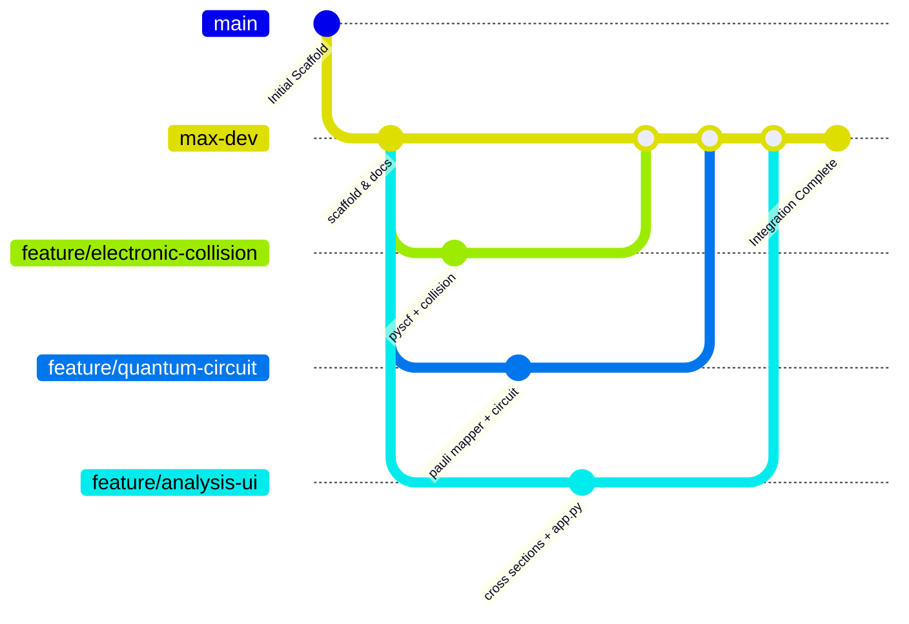

# Work Distribution & Collaborative Development Guide

**Project:** Quantum Mechanical Collisional Excitation of Plasma Neutrals and Ions  
**Hackathon Target:** Coupling PySCF Multi-Root Electronic Structure with PennyLane Multi-Level Time-Evolution Circuits  
**Git Base Branch:** `main` (All feature branches should branch from and PR into `main`)

---

## 📌 Project Context & Technical Architecture

This project simulates non-adiabatic excitation of plasma targets under electron impact for the **Beryllium isoelectronic sequence (4 electrons)**:
1. **Neutral Beryllium ($\text{Be}$, $Z=4, q=0$)**: Straight-line impact trajectory (laboratory edge plasma).
2. **Weakly Charged Carbon ($\text{C}^{2+}$, $Z=6, q=+2$)**: Moderate Coulomb hyperbolic trajectory (tokamak divertor).
3. **Highly Charged Iron ($\text{Fe}^{22+}$, $Z=26, q=+22$)**: Extreme Coulomb acceleration & high excitation energies (tokamak core / solar flare).

### End-to-End Data Flow
```
[ Track A: Electronic & Collision ]
     │  Exports: data/raw_pyscf/manifold_{species}.json (E_k, μ_ij)
     │  Exports: src/collision/interaction.py (V_ij(t) pulse matrix)
     ▼
[ Track B: Quantum Circuits & Mapper ]
     │  Consumes: E_k, μ_ij, V_ij(t)
     │  Decomposes: H(t) = H_0 + V(t) into Pauli strings
     │  Simulates: PennyLane Trotterized circuit
     │  Exports: data/processed_circuits/populations_{species}.json (P_i(t, b, E_inc))
     ▼
[ Track C: Analysis, Scaling & Dashboard ]
     │  Consumes: P_i(t, b, E_inc)
     │  Computes: Cross sections σ_j(E_inc), Branching Ratios B_j(E_inc)
     │  Synthesizes: Z-scaling laws (Be vs C2+ vs Fe22+)
     │  Renders: Streamlit UI (app.py) & Jupyter presentation notebooks
```

---

## 📦 Environment & Required Versions

All team members must use Python 3.11 with the following packages:

```ini
# Core Quantum Chemistry
pyscf>=2.5.0

# Quantum Computing Framework
pennylane>=0.36.0

# Scientific & Numerical Stack
numpy>=1.24.0,<2.0.0
scipy>=1.10.0
pandas>=2.0.0

# Visualization & App
matplotlib>=3.7.0
seaborn>=0.12.0
streamlit>=1.30.0

# Testing & Notebooks
pytest>=7.4.0
tqdm>=4.65.0
jupyterlab>=4.0.0
ipykernel>=6.25.0
```

---

## 👥 3-Person Team Breakdown & Action Items

---

### 👤 Person 1 / Track A: Electronic Structure & Collision Physics
* **Branch:** `feature/electronic-collision-engine` (branched from `max-dev`)
* **Core Ownership:** `src/electronic_structure/`, `src/collision/`, `data/raw_pyscf/`

#### 1.1 Sub-topic: PySCF Multi-Root Calculations & NIST Validation
- [ ] **Task 1.1.1:** Finalize `src/electronic_structure/pyscf_runner.py` to run State-Averaged CASSCF / Full CI for $\text{Be}, \text{C}^{2+}, \text{Fe}^{22+}$.
- [ ] **Task 1.1.2:** Compute transition 1-particle reduced density matrices (1-TDMs) and transition dipole moments $\vec{\mu}_{ij} = \langle \psi_i | \hat{\vec{r}} | \psi_j \rangle$.
- [ ] **Task 1.1.3:** Benchmark calculated excitation energies against the **NIST Atomic Spectra Database (ASD)**:
  - $\text{Be}\ (2s^2 \to 2s2p\ ^3P \approx 2.72\text{ eV},\ ^1P \approx 5.28\text{ eV})$
  - $\text{C}^{2+}\ (2s^2 \to 2s2p\ ^3P \approx 6.50\text{ eV},\ ^1P \approx 12.69\text{ eV})$
  - $\text{Fe}^{22+}\ (2s^2 \to 2s2p \approx 30-60\text{ eV})$
- [ ] **Task 1.1.4:** Export verified manifolds to `data/raw_pyscf/manifold_{species}.json`.

#### 1.2 Sub-topic: Collision Trajectories & Time-Dependent Interaction $V(t)$
- [ ] **Task 1.2.1:** Implement `src/collision/trajectories.py`:
  - **Neutral ($\text{Be}$):** Straight-line trajectory $\vec{R}(t) = (b, 0, v t)$ where $v = \sqrt{2 E_{\text{inc}} / m_e}$.
  - **Ions ($\text{C}^{2+}, \text{Fe}^{22+}$):** Classical Rutherford hyperbolic orbit in attractive Coulomb potential $V(r) = -q e^2 / r$. Implement parametric hyperbolic coordinates $(r(t), \theta(t))$.
- [ ] **Task 1.2.2:** Implement `src/collision/interaction.py`:
  - Compute electric field pulse $\vec{\mathcal{E}}(t) = -e \frac{\vec{R}(t)}{|\vec{R}(t)|^3}$.
  - Form interaction matrix $V_{ij}(t) = -\vec{\mu}_{ij} \cdot \vec{\mathcal{E}}(t)$.
  - Return total atomic Hamiltonian matrix $H_{ij}(t) = E_i \delta_{ij} + V_{ij}(t)$ over time grid $t \in [-T_{\text{max}}, +T_{\text{max}}]$.
- [ ] **Task 1.2.3:** Write unit tests in `tests/test_collision.py` testing energy conservation and trajectory asymptotes.

> 🤖 **Prompt to give to Person 1's AI Agent:**
> ```text
> You are working on Track A: Electronic Structure & Collision Physics for the UWPhysics2026 project.
> Target branch: feature/electronic-collision-engine (base: max-dev).
> Environment: Python 3.11 with pyscf>=2.5.0, numpy<2.0.0, scipy>=1.10.0.
> Your mission:
> 1. Complete src/electronic_structure/pyscf_runner.py to compute multi-root energies E_i and dipole matrices mu_ij for Be, C2+, and Fe22+, outputting to data/raw_pyscf/manifold_{species}.json.
> 2. Complete src/collision/trajectories.py supporting straight-line and Coulomb hyperbolic orbits.
> 3. Complete src/collision/interaction.py to generate the time-dependent NxN Hamiltonian H(t) = H_0 + V(t).
> Ensure zero crashes and write unit tests in tests/test_collision.py.
> ```

---

### 👤 Person 2 / Track B: Quantum Hamiltonian Mapper & PennyLane Circuits
* **Branch:** `feature/quantum-circuit-engine` (branched from `max-dev`)
* **Core Ownership:** `src/quantum/mapper.py`, `src/quantum/time_evolution.py`, `tests/test_quantum.py`

#### 2.1 Sub-topic: Multi-State Manifold to Pauli Decomposition
- [ ] **Task 2.1.1:** Implement `src/quantum/mapper.py`:
  - Map an $N$-level manifold ($N \le 8$) into $n = \lceil \log_2 N \rceil$ qubits (e.g. 4 states $\to$ 2 qubits; 8 states $\to$ 3 qubits).
  - Embed $N \times N$ matrix into $2^n \times 2^n$ Hilbert space.
  - Implement function `decompose_hamiltonian_to_paulis(H_matrix) -> (coefficients, pauli_strings)` using PennyLane `qml.pauli_decompose` or projection operator expansion $|i\rangle\langle j| \to \text{Pauli basis}$.
- [ ] **Task 2.1.2:** Implement automated time-series decomposition: $H(t) \to \sum_k c_k(t) \hat{P}_k$.

#### 2.2 Sub-topic: PennyLane Quantum Time-Evolution Circuit
- [ ] **Task 2.2.1:** Implement `src/quantum/time_evolution.py`:
  - Define PennyLane device (e.g., `default.qubit` for exact statevector, and optional noisy simulator).
  - Build Trotterized unitary evolution step:
    $$U(t_k + \Delta t, t_k) \approx \prod_m \exp\left(-i c_m(t_k) \hat{P}_m \Delta t\right)$$
    using `qml.ApproxTimeEvolution` or sequenced Pauli rotations (`qml.PauliRot` / `qml.RZ`, `qml.RY`, CNOT ladders).
- [ ] **Task 2.2.2:** Multi-State Population Tracking:
  - Initial state: $|0\dots0\rangle$ (ground state $E_0$).
  - Measure state probabilities $P_i(t) = |\langle i | \psi(t) \rangle|^2$ across all time steps $t \in [-T, +T]$.
  - Verify unitarity condition: $\sum_{i=0}^{N-1} P_i(t) = 1.0$ at all time steps.
- [ ] **Task 2.2.3:** Implement batch sweep function over impact parameters $b$ and energies $E_{\text{inc}}$, saving results to `data/processed_circuits/populations_{species}.json`.
- [ ] **Task 2.2.4:** Write unit tests in `tests/test_quantum.py`.

> 🤖 **Prompt to give to Person 2's AI Agent:**
> ```text
> You are working on Track B: Quantum Circuit & Pauli Mapper for the UWPhysics2026 project.
> Target branch: feature/quantum-circuit-engine (base: max-dev).
> Environment: Python 3.11 with pennylane>=0.36.0, numpy<2.0.0, scipy>=1.10.0.
> Your mission:
> 1. In src/quantum/mapper.py, map the NxN time-dependent Hamiltonian H(t) into Pauli strings using PennyLane's Pauli decomposition on ceil(log2(N)) qubits.
> 2. In src/quantum/time_evolution.py, construct a Trotterized quantum time-evolution circuit in PennyLane to evolve the system from t = -T to +T under the collision pulse.
> 3. Measure and return population dynamics P_i(t) for all states, saving traces to data/processed_circuits/populations_{species}.json.
> Verify population conservation sum(P_i) == 1 and write unit tests in tests/test_quantum.py.
> ```

---

### 👤 Person 3 / Track C: Cross-Section Integration, Scaling Laws & UI Dashboard
* **Branch:** `feature/analysis-scaling-ui` (branched from `max-dev`)
* **Core Ownership:** `src/analysis/`, `app.py`, `notebooks/`, `tests/test_analysis.py`

#### 3.1 Sub-topic: Impact Parameter Integration & Branching Ratios
- [ ] **Task 3.1.1:** Implement `src/analysis/cross_sections.py`:
  - Integrate transition probabilities $P_{0 \to j}(b, E_{\text{inc}})$ over impact parameter $b \in [b_{\min}, b_{\max}]$:
    $$\sigma_{0 \to j}(E_{\text{inc}}) = 2\pi \int_{0}^{b_{\max}} P_{0 \to j}(b, E_{\text{inc}}) \, b \, db$$
  - Compute energy-dependent Branching Ratios:
    $$\mathcal{B}_{0 \to j}(E_{\text{inc}}) = \frac{\sigma_{0 \to j}(E_{\text{inc}})}{\sum_{k \neq 0} \sigma_{0 \to k}(E_{\text{inc}})}$$
- [ ] **Task 3.1.2:** Analyze cascade channels (direct $0 \to 2$ excitation vs cascade $0 \to 1 \to 2$).

#### 3.2 Sub-topic: Isoelectronic $Z$-Scaling Synthesis
- [ ] **Task 3.2.1:** Implement `src/analysis/scaling_laws.py`:
  - Compare Neutral $\text{Be}\ (Z=4)$ vs $\text{C}^{2+}\ (Z=6)$ vs $\text{Fe}^{22+}\ (Z=26)$.
  - Plot energy gap scaling $\Delta E(Z) \sim Z$ and transition dipole scaling $\mu(Z) \sim 1/Z$.
  - Quantify Coulomb focusing enhancements on cross sections: $\sigma_{\text{ion}} / \sigma_{\text{neutral}}$.

#### 3.3 Sub-topic: Interactive Streamlit App & Presentation Notebooks
- [ ] **Task 3.3.1:** Build interactive dashboard `app.py` (Streamlit):
  - Species selector ($\text{Be}, \text{C}^{2+}, \text{Fe}^{22+}$).
  - Sliders for $E_{\text{inc}}\ (\text{eV})$ and impact parameter $b\ (a_0)$.
  - Live charts:
    1. Collision trajectory $\vec{R}(t)$ & Pulse $\vec{\mathcal{E}}(t)$.
    2. Quantum state population dynamics $P_i(t)$ vs time.
    3. Branching ratios vs incident electron energy.
    4. Isoelectronic comparative scaling panel.
- [ ] **Task 3.3.2:** Create Jupyter demonstration notebooks in `notebooks/`:
  - `01_pyscf_manifold_demo.ipynb`
  - `02_pennylane_collision_demo.ipynb`
  - `03_isoelectronic_scaling_study.ipynb`

> 🤖 **Prompt to give to Person 3's AI Agent:**
> ```text
> You are working on Track C: Analysis, Scaling Laws & Streamlit UI for the UWPhysics2026 project.
> Target branch: feature/analysis-scaling-ui (base: max-dev).
> Environment: Python 3.11 with streamlit>=1.30.0, matplotlib>=3.7.0, scipy>=1.10.0, pandas>=2.0.0.
> Your mission:
> 1. Complete src/analysis/cross_sections.py to calculate excitation cross-sections sigma_j(E_inc) via impact parameter integration and compute Branching Ratios.
> 2. Complete src/analysis/scaling_laws.py to evaluate Z-scaling across Be, C2+, and Fe22+.
> 3. Build a beautiful interactive Streamlit application in app.py displaying real-time trajectory, quantum population dynamics P_i(t), branching ratios, and scaling plots.
> 4. Create polished Jupyter demo notebooks in notebooks/.
> ```

---

## 🔄 Standardized JSON Data Contracts (Zero-Conflict Schema)

### 1. Electronic Structure Output (`data/raw_pyscf/manifold_{species}.json`)
```json
{
  "species": "Be",
  "atomic_number": 4,
  "charge": 0,
  "n_states": 4,
  "energies_au": [0.0, 0.194, 0.272, 0.397],
  "energies_ev": [0.0, 5.28, 7.40, 10.80],
  "dipole_matrix_x": [[0.0, 0.0, ...], ...],
  "dipole_matrix_y": [[0.0, 0.0, ...], ...],
  "dipole_matrix_z": [[0.0, 0.9, 0.0, ...], ...],
  "oscillator_strengths": [0.0, 0.105, ...]
}
```

### 2. Quantum Circuit Simulation Output (`data/processed_circuits/populations_{species}.json`)
```json
{
  "species": "Be",
  "n_states": 4,
  "incident_energy_ev": 50.0,
  "impact_parameter_bohr": 2.0,
  "time_grid_au": [-10.0, -9.5, ..., 10.0],
  "populations": {
    "state_0": [1.0, 0.99, ..., 0.72],
    "state_1": [0.0, 0.01, ..., 0.21],
    "state_2": [0.0, 0.00, ..., 0.05],
    "state_3": [0.0, 0.00, ..., 0.02]
  }
}
```

---

## 🛠️ Step-by-Step Collaborative Git Workflow



1. **Start from `max-dev`**:
   ```bash
   git checkout max-dev
   git pull origin max-dev
   ```
2. **Create your feature branch**:
   - Person 1: `git checkout -b feature/electronic-collision`
   - Person 2: `git checkout -b feature/quantum-circuit`
   - Person 3: `git checkout -b feature/analysis-ui`
3. **Develop, test, and commit**:
   ```bash
   git add .
   git commit -m "feat(module): descriptive message"
   ```
4. **Merge back into `max-dev`**:
   ```bash
   git checkout max-dev
   git merge feature/<your-feature-branch>
   ```
